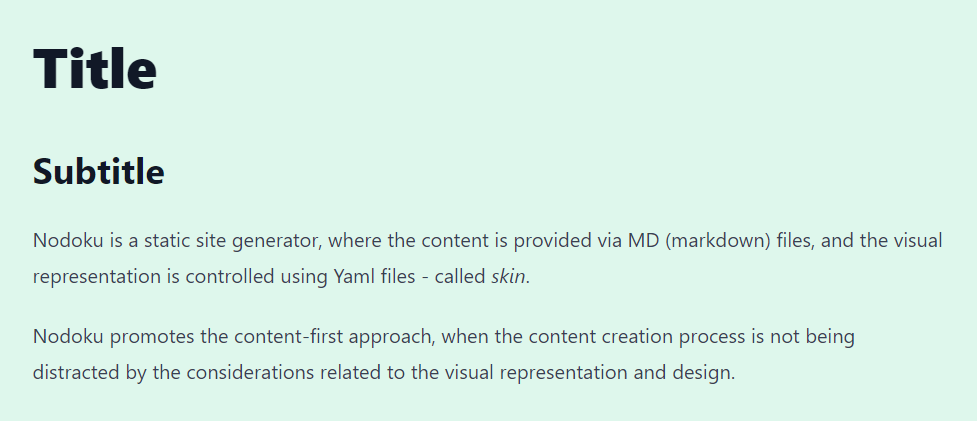

<!-- TOC -->
* [Nodoku Typography component](#nodoku-typography-component)
  * [Definition in Nodoku skin](#definition-in-nodoku-skin)
* [HighlightedCode - a utility function component](#highlightedcode---a-utility-function-component-)
* [Usage](#usage)
  * [Generating prefixed themes](#generating-prefixed-themes)
  * [Building the whole bundle](#building-the-whole-bundle)
<!-- TOC -->

**_nodoku-components_** is a utility library for [Nodoku static site generator](https://github.com/nodoku/nodoku-core).

It contains the following components:
- **_Typography_**: Nodoku visual component capable of rendering the textual content based on the Tailwind [Typography](https://github.com/tailwindlabs/tailwindcss-typography) plugin.

and the following utility functions, intended to be used in other Nodoku components (they are not Nodoku visual components by themselves):

- **_HighlightedCode_**: a component capable of rendering a code snippet (based on [highlight.js](https://github.com/highlightjs/highlight.js) library)
- **_ListComp_**: a component rendering lists (Html tags ```<ul>``` and ```<ol>```)
- **_Paragraphs_**: a utility function used to render paragraphs in a Nodoku component
- **_Backgrounds_**: a utility function used to define background of a Nodoku component

# Nodoku Typography component

The Nodoku Typography component can be used to beautifully render any textual content, thanks to the Tailwind [Typography](https://github.com/tailwindlabs/tailwindcss-typography) plugin.

In order to use this component make sure to install (along with nodoku-core) nodoku-components as follows:
```shell
npm install nodoku-core nodoku-components
```
And make sure to run the generation scripts, as described in the [nodoku-core documentation](https://github.com/nodoku/nodoku-core?tab=readme-ov-file#nodoku-generation-scripts).

In addition, the Typography plugin should be defined in the Tailwind config - **_tailwind.config.ts_** - that is located in the project, as follows:

```ts
import type {Config} from "tailwindcss";
import * as typo from '@tailwindcss/typography';

const config: Config = {
    content: [
        // the Nodoku paths definitions go here
    ],

    theme: {
        extend: {
            typography: {
                DEFAULT: {
                    css: {
                        // unset maxWidth to remove the default sizing of the Typography plugin
                        maxWidth: 'unset', 
                    }
                }
            }
        },
    },
    plugins: [
        typo.default(),
    ],
};

export default config;

```

## Definition in Nodoku skin

The name of the Typography component is ```core/typography```

If everything works well, you should be able to use the Nodoku Typography in the Nodoku skin file as follows:

```yaml
# yaml-language-server: $schema=../../../schemas/visual-schema.json

rows:
  - row:
      maxCols: 1
      components:
        - core/typography:
            theme:
              contentContainerStyle:
                decoration: prose-xl p-10 bg-green-100
            selector:
              attributes:
                sectionName: typography2
```

And here is the MD file to use with this skin

```md

```yaml
nd-block:
  attributes:
    sectionName: typography
``

# Title

## Subtitle

Nodoku is a static site generator, where the content is provided via MD (markdown) files, and the visual representation is controlled using Yaml files - called _skin_.

Nodoku promotes the content-first approach, when the content creation process is not being distracted by the considerations related to the visual representation and design.
```

The result of the rendering is as follows:




# HighlightedCode - a utility function component 

This utility component is used to render a piece of code. For highlighting, it uses highlight.js behind the scenes.

The component is capable of displaying a code snippet in pre-selected theme.

This is achieved thanks to the fact that predefined highlight.js theme CSS files are preprocessed, to prefix the classnames with the theme name, as follows (for ```agate``` theme):

```css
.hljs-theme-agate code.hljs {
  padding: 3px 5px
}
```

For more details about this process and the rationale behind this please see the blog article: [Highlight your code: scope highlight.js theme to a single component](https://epanikas.hashnode.dev/highlight-your-code-scope-highlightjs-theme-to-a-single-component)

This componet is used by the ```Paragraphs``` components to render the paragraphs that are actually code snippets (represented by NdCode data structure)


# Usage

## Generating prefixed themes

the script to generate the prefixed CSS themes

```shell
npm run highlight.js-prefix
```

## Building the whole bundle

The bundle can be build as follows:

```shell
npm run dist
```

