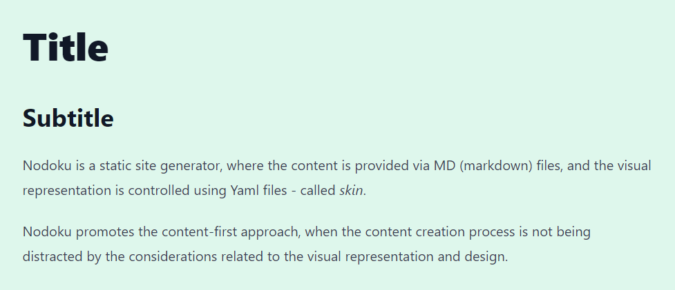

<!-- TOC -->
* [Nodoku Typography component](#nodoku-typography-component)
  * [Definition in Nodoku skin](#definition-in-nodoku-skin)
* [HighlightedCode - a utility function component](#highlightedcode---a-utility-function-component-)
* [Usage](#usage)
  * [Generating prefixed themes](#generating-prefixed-themes)
  * [Building the whole bundle](#building-the-whole-bundle)
<!-- TOC -->


GitHub link: https://github.com/nodoku/nodoku-components


**_nodoku-components_** is a utility library for [Nodoku static site generator](https://github.com/nodoku/nodoku-core).

It contains the following components:
- **_Typography_**: Nodoku visual component capable of rendering the textual content based on the Tailwind [Typography](https://github.com/tailwindlabs/tailwindcss-typography) plugin.

and the following utility functions, intended to be used in other Nodoku components (they are not Nodoku visual components by themselves):

- **_HighlightedCode_**: a component capable of rendering a code snippet (based on [highlight.js](https://github.com/highlightjs/highlight.js) library)
- **_ListComp_**: a component rendering lists (Html tags ```<ul>``` and ```<ol>```)
- **_Paragraphs_**: a utility function used to render paragraphs in a Nodoku component
- **_Backgrounds_**: a utility function used to define background of a Nodoku component

# Nodoku Typography component

The Nodoku Typography component can be used to beautifully render any textual content, thanks to the Tailwind [Typography](https://github.com/tailwindlabs/tailwindcss-typography) plugin.

In order to use this component make sure to install (along with nodoku-core) nodoku-components as follows:
```shell
npm install nodoku-core nodoku-components
```
And make sure to run the generation scripts, as described in the [nodoku-core documentation](https://github.com/nodoku/nodoku-core?tab=readme-ov-file#nodoku-generation-scripts).

In addition, the Typography plugin should be defined in the Tailwind config - **_tailwind.config.ts_** - that is located in the project, as follows:

```ts
import type {Config} from "tailwindcss";
import * as typo from '@tailwindcss/typography';

const config: Config = {
    content: [
        // the Nodoku paths definitions go here
    ],

    theme: {
        extend: {
            typography: {
                DEFAULT: {
                    css: {
                        // unset maxWidth to remove the default sizing of the Typography plugin
                        maxWidth: 'unset', 
                    }
                }
            }
        },
    },
    plugins: [
        typo.default(),
    ],
};

export default config;

```

## Definition in Nodoku skin

The name of the Typography component is ```core/typography```

If everything works well, you should be able to use the Nodoku Typography in the Nodoku skin file as follows:

```yaml
# yaml-language-server: $schema=../../../schemas/visual-schema.json

rows:
  - row:
      maxCols: 1
      components:
        - core/typography:
            theme:
              contentContainerStyle:
                decoration: prose-xl p-10 bg-green-100
            selector:
              attributes:
                sectionName: typography2
```

And here is the MD file to use with this skin

```md

```yaml
nd-block:
  attributes:
    sectionName: typography
``

# Title

## Subtitle

Nodoku is a static site generator, where the content is provided via MD (markdown) files, and the visual representation is controlled using Yaml files - called _skin_.

Nodoku promotes the content-first approach, when the content creation process is not being distracted by the considerations related to the visual representation and design.
```

The result of the rendering is as follows:




# HighlightedCode - a utility function component 

This utility component is used to render a piece of code. For highlighting, it uses highlight.js behind the scenes.

The component is capable of displaying a code snippet in pre-selected theme.

This is achieved thanks to the fact that predefined highlight.js theme CSS files are preprocessed, to prefix the classnames with the theme name, as follows (for ```agate``` theme):

```css
.hljs-theme-agate code.hljs {
  padding: 3px 5px
}
```

For more details about this process and the rationale behind this please see the blog article: [Highlight your code: scope highlight.js theme to a single component](https://epanikas.hashnode.dev/highlight-your-code-scope-highlightjs-theme-to-a-single-component)

This componet is used by the ```Paragraphs``` components to render the paragraphs that are actually code snippets (represented by NdCode data structure)


# Usage

## Generating prefixed themes

the script to generate the prefixed CSS themes

```shell
npm run highlight.js-prefix
```

## Building the whole bundle

The bundle can be build as follows:

```shell
npm run dist
```


# Nodoku license

The Nodoku License to be used depends on the use case you plan to use Nodoku for:

- using Nodoku to build an End Product, which is a webpage or a website for private or commercial use
  - in short, in this case Nodoku **_is free_** to use under the MIT License (see below for more details)
- using Nodoku to build an End Product, which is a webpage or a website builder (online or offline)
  - in short, in this case the use of Nodoku **_is prohibited_**


Note, that
> in any case of the allowed, free-of-charge use of Nodoku, **_the present Nodoku license should be included in all copies of the Software, using Nodoku_**.


## Use for private, educational or commercial needs, excluding applications for webpage or website building tools

Any use of Nodoku, **_except for webpage and website builder applications_**, is allowed free of charge, under the **_MIT license_** ( see the [LICENSE](./blob/main/LICENSE) )


## Use as part of website or webpage builders

The use of Nodoku for the purposes to provide a solution for online (or offline) website or webpage builders is **_prohibited_**.

This prohibition includes the direct or indirect use of the Nodoku library as part of webpage builder solution.

Indirect use of Nodoku library would include building a software or a framework that would then be used as part of webpage or website builder.

Webpage or Website builder application is any tool, online or offline, that would allow the End User to build a publishable webpage or website, using no code or low amount of code.

This is prohibited under this license term since that would constitute a direct competition to Nodoku lo-code site builder.

# Examples

## Proper use, free of charge, under the MIT License

- building a webpage or a website for a private non-commercial project
- building a webpage or a website for a private commercial project
- building a webpage or a website for a public commercial or non-commercial blog
- building a webpage or a website for a client, that would use it for commercial or non-commercial purposes
- creating and distributing non-commercially (free of charge) custom Nodoku components
- creating and distributing commercially custom Nodoku components (developing and selling out new Nodoku-compatible UI components)
- developing new UI components and selling them out either as a Nodoku component, or a standalone component, or a component compatible with another website builder

## Prohibited use

- building a website builder, that would use the Nodoku engine to provide the End User with a tool, that would allow them building their own webpages or websites
- using Nodoku engine to provide the End User with an automatic, semi-automatic or manual framework, that would allow them building their own webpages or websites
- using Nodoku libraries to use it as part of the solution that would allow the End User to build a webpage or a website
